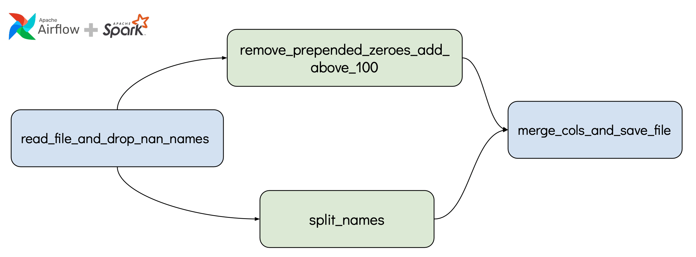

## Databases

### Overview of the files: 
<!-- toc -->
- `dags\transform_data_dag.py`: Consists of airflow DAG 
- `data`: 
   - `raw_data\`
   - `processed_data\`
- `spark`: python files containing dag tasks 
  - `merge_cols_and_save_file.py`
  - `read_file_and_drop_nan_names.py`
  - `remove_prepended_zeroes_add_above_100.py`
  - `split_names.py`
- `test.ipynb`: Test noteboook for the pyspark sql queries
<!-- tocstop -->

### Processed Files
[dataset1.csv](data/processed_data/dataset1.csv/part-00000-38f65a3c-9457-454b-b8f2-67f3bb75f0a7-c000.csv)
[dataset2.csv](data/processed_data/dataset2.csv/part-00000-ea574ded-daf7-4477-a498-dd938e8f81c8-c000.csv)

### Data Pipeline

Processing large scale data within Airflow tasks does not scale and should only be used in cases where the data are limited in size. A better option for scalability is to offload any heavy-duty processing to a Spark, then use Airflow to orchestrate the jobs. 

In this data pipeline, the Airflow tasks are run by Spark. The data manipulation is accomplished using PySpark SQL. 

#### The Airflow DAG -- executed at 1 am daily -- consists of 4 tasks:

- Task 1 **read_file_and_drop_nan_names**: Reads csv from the data path (from `data\raw_data`) and removes rows with `name` as NaN. The processed csv is then saved as a new file - `dataset_v1.csv`
- Task 2 **split_names**:  Reads `dataset_v1.csv`, processes `name` and saves a csv containing only `first_name` and `last_name`  columns in  `dataset_name.csv`
- Task 3 **remove_prepended_zeroes_add_above_100**:  Reads `dataset_v1.csv`, processes `price` and saves only `price` and `above_name` columns in `dataset_price.csv`
- Task 4 **merge_cols_and_save_file**: Reads and merges `dataset_name.csv` and `dataset_price.csv` files and save in `processed/dataset.csv`

`Task 2` and `Task 3` are run in parallel since they are independent -- manipulate separate columns with no reduction in rows count.   
