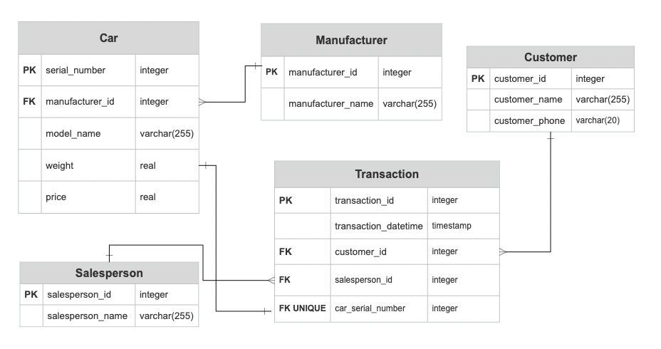

## Databases

### Overview of the files: 
<!-- toc -->
- `Dockerfile`: Docker image to spin-up PostgreSQL server and run the DDL statements
- `car_sales_db_init.sql`: SQL statements to create tables and insert values.
- `er_car_sales_db.png`: ER diagram image
- `queries.sql`: SQL statements to run the 2 queries 
<!-- tocstop -->

### Database ER-diagram 


### Assumptions regarding the 2 queries 

##### 1. I want to know the list of our customers and their spending.
- A customer with no transaction is returned with a `zero` spending. Although, it is highly unlikely to have a customer with no transaction. 

##### 2. I want to find out the top 3 car manufacturers that customers bought by sales (quantity) and the sales number for it in the current month
- `top 3` by sales - Manufactureres having sales INCLUDED in the 3 highest sales (i.e. ranked among {1, 2, 3})
- Query always returns at least 3 manufacturers by sales
- Examples: 
```
            Top 3 highest sales - [2000, 1990, 1990]  
            Manufacturers with the top 3 sales - ['M1', 'M4', 'M6', 'M9'] # can be multiple 
            
            Top 3 highest sales - [8000, 8003, 80006]  
            Manufacturers with the top 3 sales - ['M1', 'M4', 'M5', 'M10', 'M11'] # can be multiple 

            Top 3 highest sales - [9000, 9000, 9000]  
            Manufacturers with the top 3 sales - ['M1', 'M4', 'M5']
```
