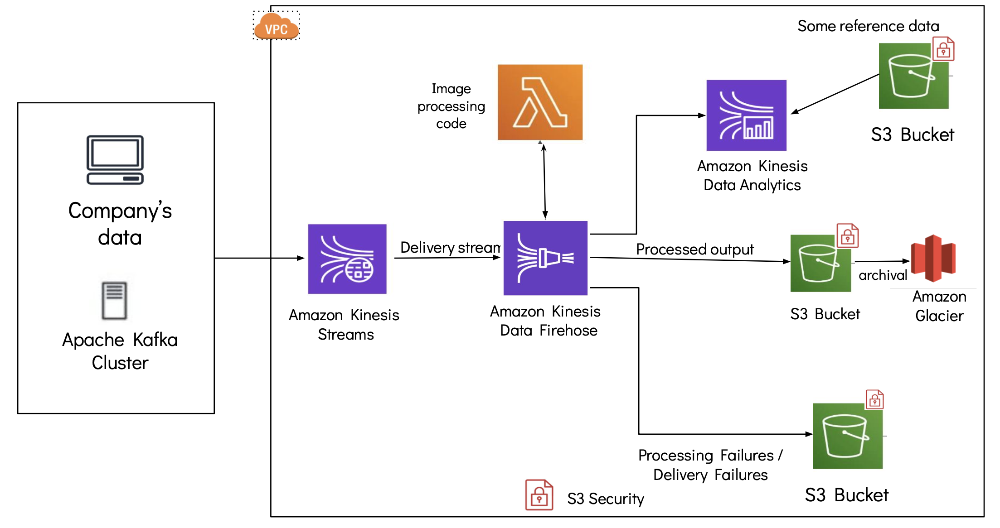

## System Design

### Overview of the files: 
<!-- toc -->
- `system_design_aws.pdf`: AWS infrastructure diagram PDF
- `system_design_aws.png`: AWS infrastructure diagram image
<!-- tocstop -->

### AWS Data Infrastructure for low-latency large scale image processing, analytics and storage

### Services
-  Company's `Virtual Private Network` (VPC): virtual network for running instances
- `Amazon Kinesis Data Stream`: low latency streaming ingestion of the image data from web application and stream of images. Kinesis Data Streams can handle records upto 1MB
- `Amazon Kinesis Data Firehose`: loads streams into S3 Data after applying processing through AWS Lambda
- `Lambda Function` (Serverless): runs company's provided code for image processing 
- `Amazon Kinesis Data Analytics`: performs real-time analytics on processed image data using SQL and references other data such as customer records
- `S3 Bucket`: 
        1) For storing processed images
        2) For recoring failure cases such as error during processing of an image
        3) For storing some reference data such as customers details 
        
   Security with IAM policies for role based user access. 
- `Amazon Glacier`: For archiving the processed image data

### Assumptions 
- Access to company's image data
- Company software engineer provided the code to process images
- Web application is visited by millions of people every day and data generated in petabyte scale
- Images can be upto 1MB in size and in format supported by AWS S3. 
- Company expected low-latency of data processing
- Company's customers data stored in S3 bucket (see `reference data` in the diagram) for querying
- Company has dozens of teams and for security the company has role-based access to the stored data 

### Extra insights
- `Amazon Glue Crawler`, `Amazon Athena` and `Amazon Quicksight` can be used for analytics and visualizations on a dashboard for Business Intelligence.
- Images can be encrypted during transit (by using TLS / SSL) and at rest (by using SSE-S3 and SSE-KMS) for privacy
- Monitoring and logging can be added using `Amazon CloudWatch`, `Amazon CloudTrail`, `Amazon SQS` and so on
