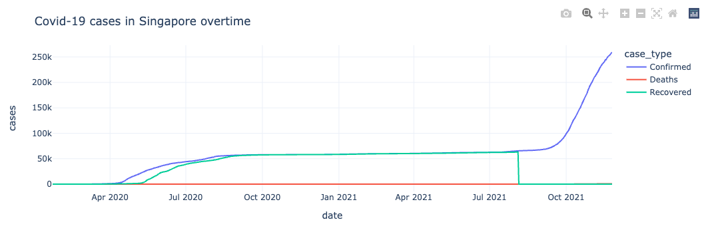

## Charts and APIS

### Overview of the files: 
<!-- toc -->
- `dash_component_covid19_cases.png`: Dashboard COVID-19 cases component image
- `covid19_cases.ipynb`:  Notebook containing code
- `covid19_cases.pdf`: Notebook to pdf
<!-- tocstop -->

### Interactive dashboard component - COVID-19 cases in Singapore overtime

### Extra insights:
- Webhook API can be used to update the COVID-19 cases graph on a daily bases
